Lab 4
=====

Keys Pressed:
```ssh cs15lsp23nm@ieng6.ucsd.edu<enter>``` 
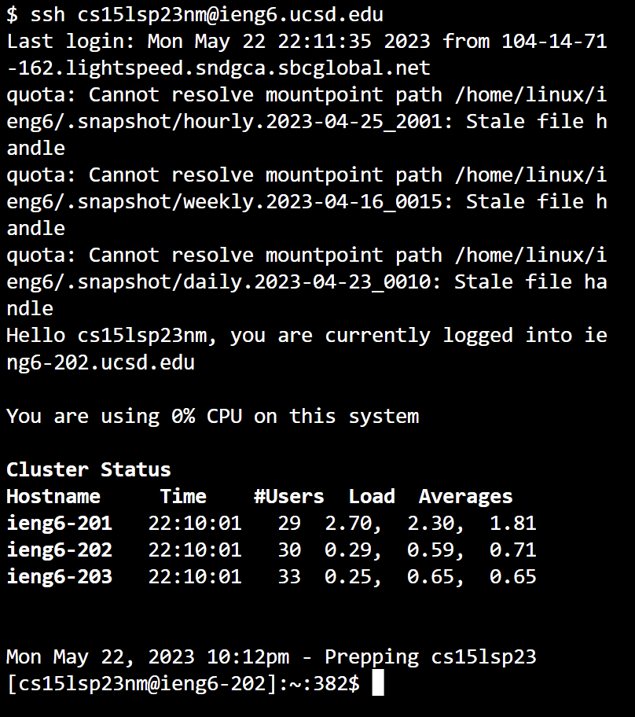
Because I am doing this on a fresh shell, commands were not available from previous attempts.

Keys Pressed:
```cd -- -cs<tab><enter>ls<enter>```
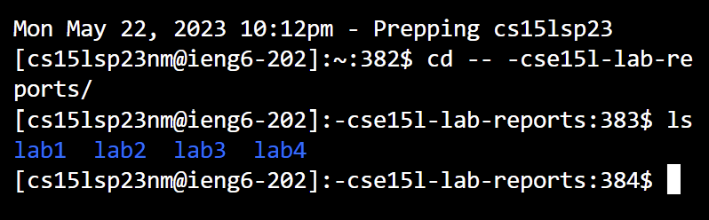
The directory holding my lab stuff is in -cs15l-lab-reports, which can be gotten too more quickly with ```<tab>```.

Keys Pressed:
```cd lab4<enter>ls<enter>```
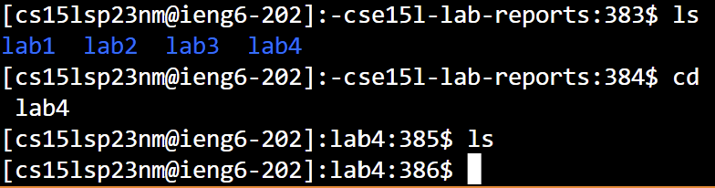
Just changing directories to the one where I want to clone it.

Keys Pressed:
```<ctrl>v<enter>ls<enter>```
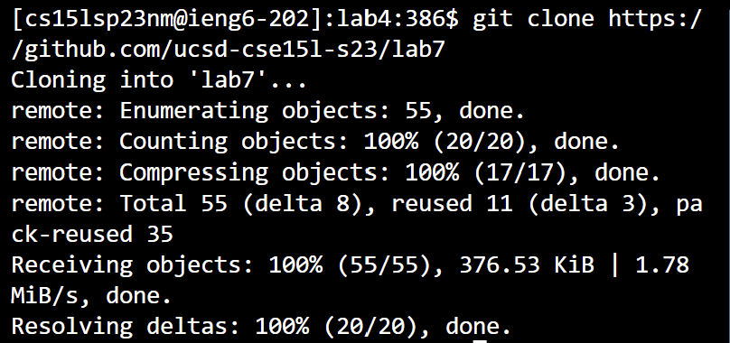
Because the  git clone command was already on my clipboard, I was able to paste it into the terminal. Then I used ls to check it was there

Keys Pressed:
```cd lab7<enter>ls<enter>```
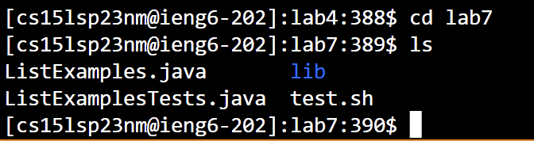
Just entering the directory

Keys Pressed:
```bash test.sh<Enter>```
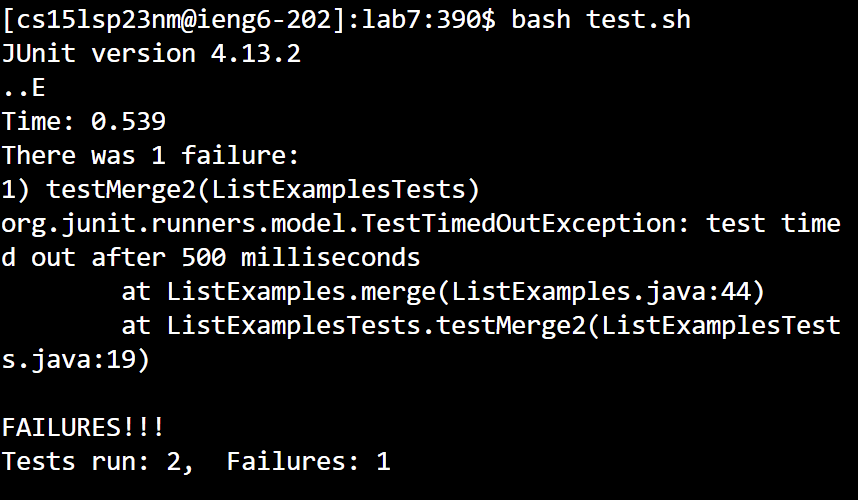
Running bash test script.

Keys Pressed:
```vim ListExamples.java```
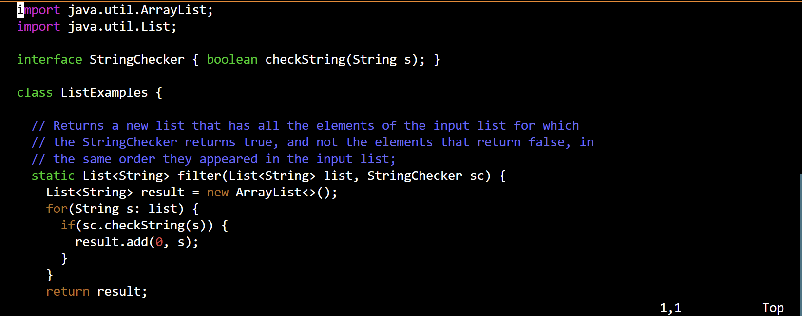
Opens the java file in vim.

Keys Pressed:
```<Shift>g6kexi2<Esc>```
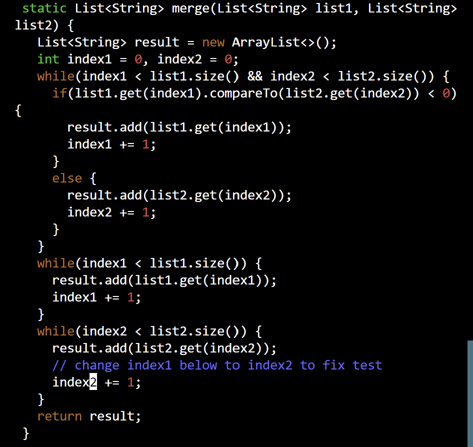
```Shift + G``` brings the cursor to the bottom of the document. ```6k``` moves the cursor up 6 lines. ```e``` moves the cursor to the next word, which is index1 inthis case. ```x``` deletes the character it is over, which is the number 1 in this case. ```i``` puts vim in insertion mode. ```2``` add the number 2 where the cursor is. ```<Esc>``` Brings vim back into command mode.

Keys Pressed:
```:wq<Enter>```
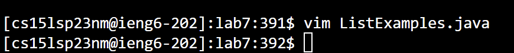
Saves and quits the file.

Keys Pressed:
```<up><up><Enter>``
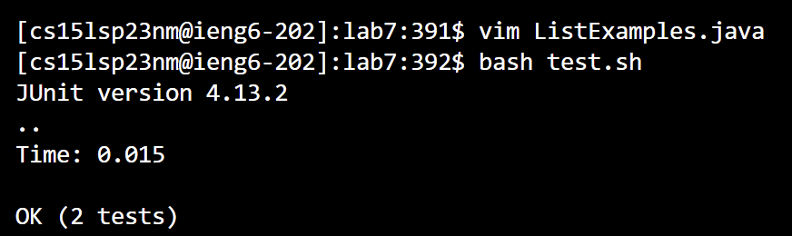
Because the bash script was done earlier, I can just press up twice to get to it again. And we can see the tests succeed.

Keys Pressed:
```git add*<Enter>git commit -m "message"<Enter>git push```
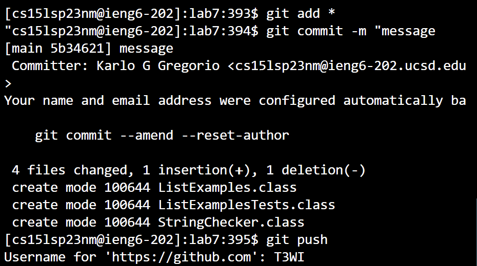
I also might have not set up the ssh for this account yet oops.