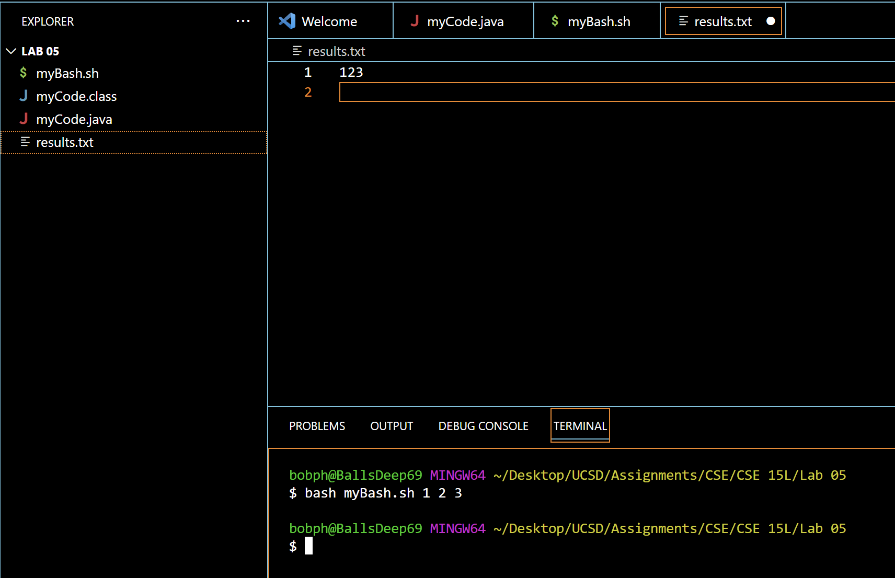
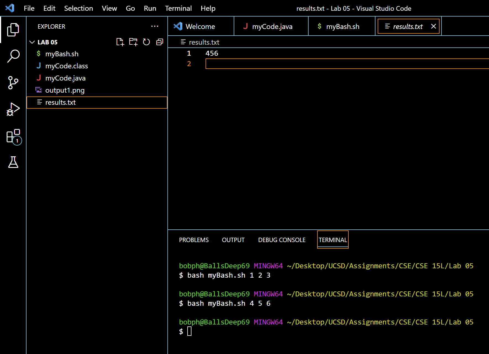
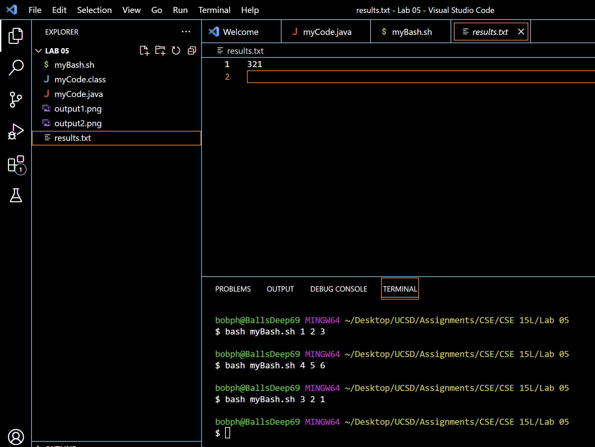
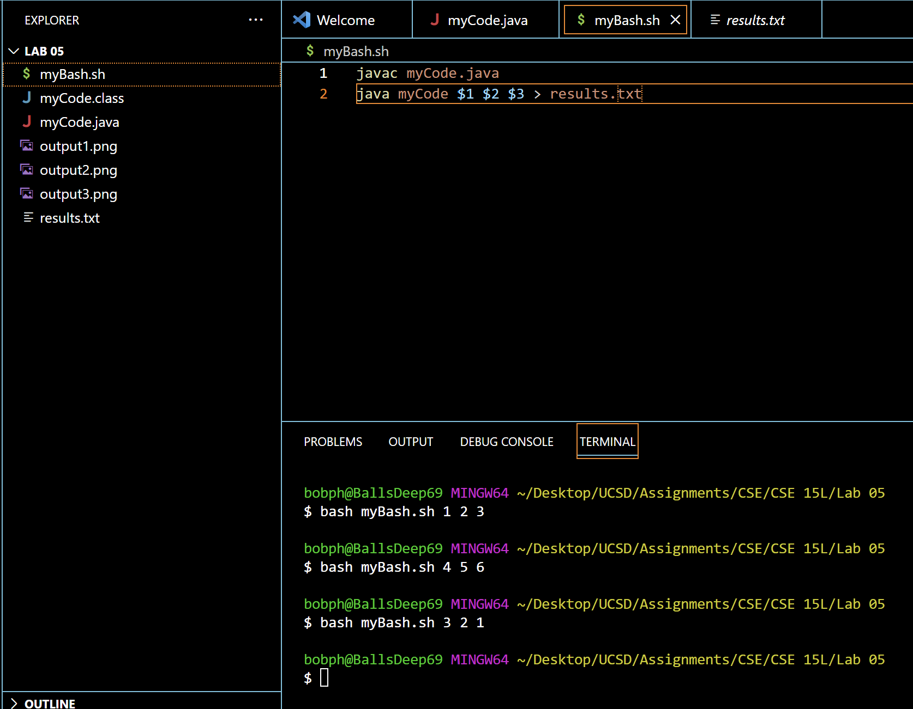
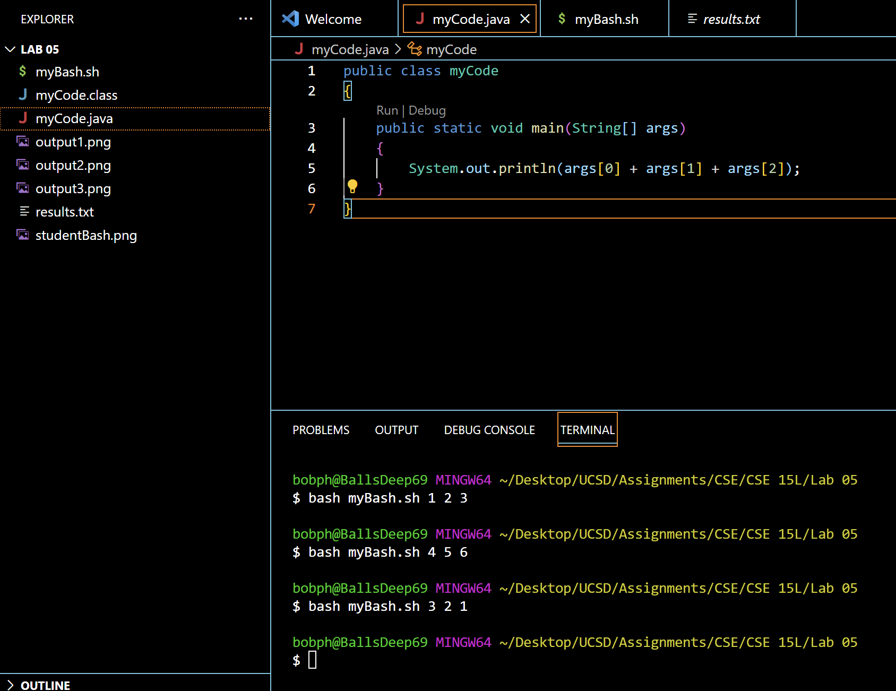
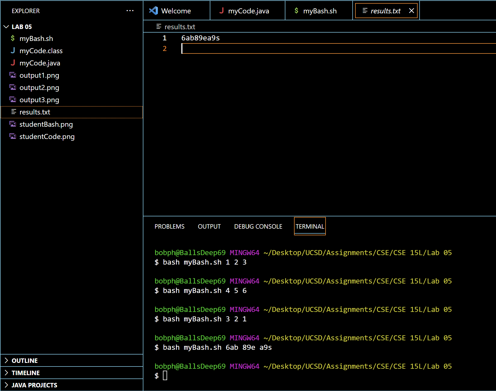
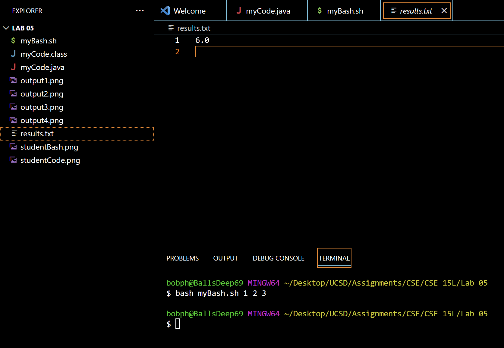
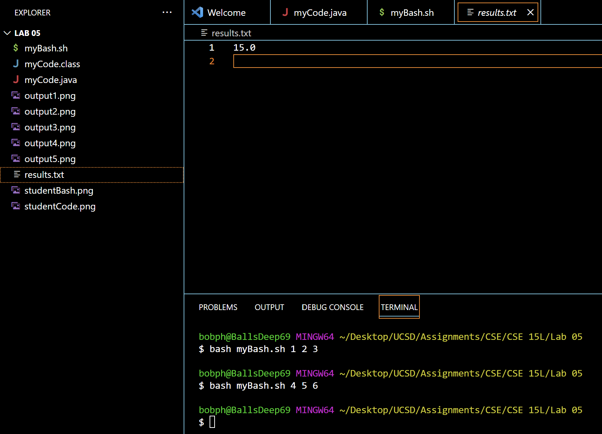
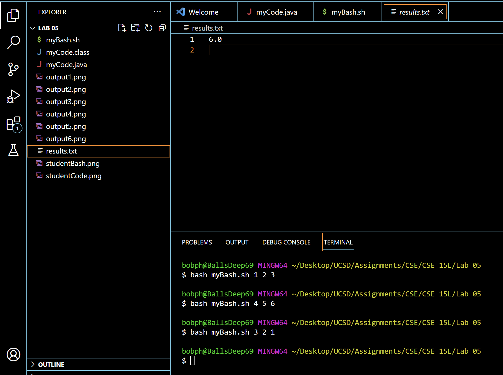
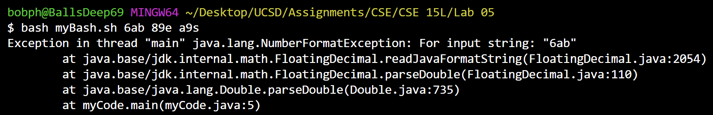

# Lab 5 
## Debugging Scenario
**What environment are you using (computer, operating system, web browser, terminal/editor, and so on)?**
Windows

**Detail the symptom you're seeing. Be specific; include both what you're seeing and what you expected to see instead. Screenshots are great, copy-pasted terminal output is also great. Avoid saying “it doesn't work”.**
It doesn't work :(. The program is supposed to print the sum of the arguments called by java onto a text file. Output from the java file is being put into the txt file, but the output isn't what I was expecting. Whenever I input 3 numbers, the output is 3-digit number that is composed of the input numbers in the order of it being inputted in the java command. We should expect it to output 6, 15, and 6.

Here is the bash script and the java code:

**Detail the failure-inducing input and context. That might mean any or all of the command you're running, a test case, command-line arguments, working directory, even the last few commands you ran. Do your best to provide as much context as you can.**
In the commands I posted above, all three commands ran were failure-inducing inputs. They all outputted a combination of the inputs as the output. 

**TA RESPONSE**
Try and use combinations of letters and numbers as inputs to java. Think carefully about what kind of data you are passing in through the main function's args parameter, as well as what kind of operations you are performing in the print statement.

**STUDENT SECOND RESPONSE**
It looks like inputting a combination of letters and numbers into the java file produces a txt file that is a combination of the inputs. Because letters were also used as inputs, it means that strings are being passed in as inputs, which makes sense, because the main function takes in string arguments. Because I left the arguments as strings, strings were passed into the print function, and the `+` operator acted as a concatenator instead of doing addition, which is why it produced the combined output of inputs at the results.txt file. 

To fix this, all I have to do is convert the string inputs of args into doubles. I can do this using the parseDouble() function.

And if we try to put in strings like before, we should expect an error, as we do here:

